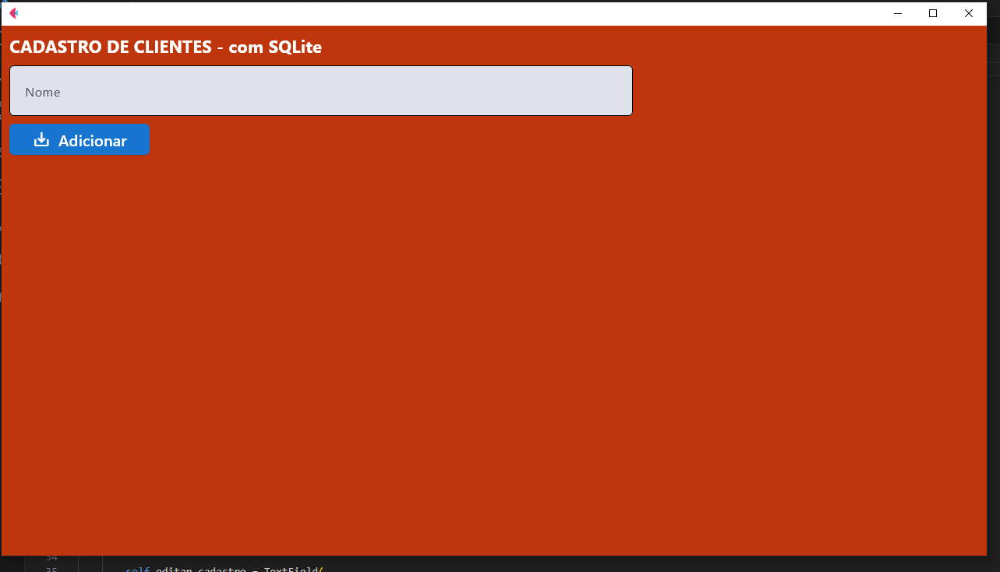
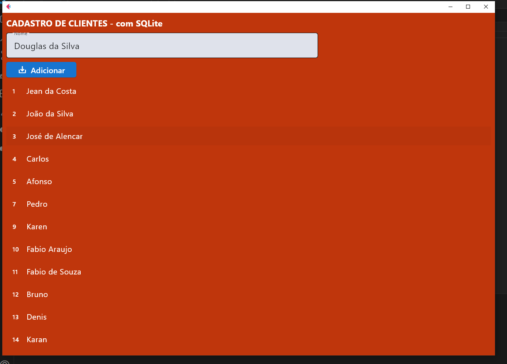

<h2>Sistema de Cadasto - CRUD</h2>

Apresento meu projeto de Cadastros desenvolvido com <strong>Python</strong>, a "recente" biblioteca <strong>Flet</strong> e também <strong>SQLite</strong>! 
  Esta aplicação simples permite criar, visualizar, e editar cadastros de forma eficiente. Utilizei <strong>Python</strong> para a lógica de backend, o <strong>Flet</strong> 
  para criar a interface Desktop, Mobile ou Web, e o <strong>SQLite</strong> para armazenar os dados. Este projeto é uma demonstração do meu trabalho em desenvolvimento e gerenciamento de bancos de dados, 
  oferecendo uma solução prática para o registro de informações."

  * O Flet é uma forma de compilar os códigos escritos em Python para Dart. Com ele não é necessário que você saiba Dart, 
  você pode fazer todo o seu código em Python e usar o Flutter normalmente, assim criando aplicações de celulares, apenas compilando no Flet.

